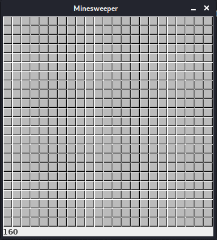
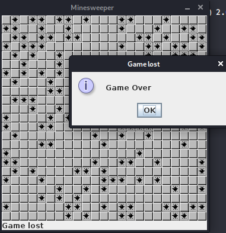
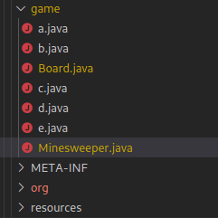
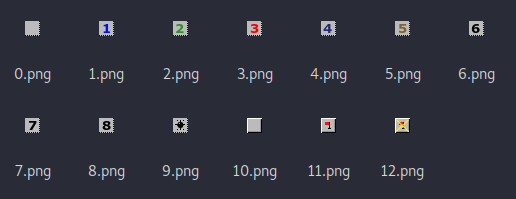
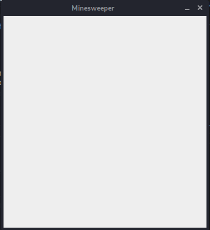
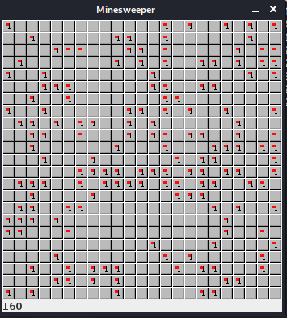
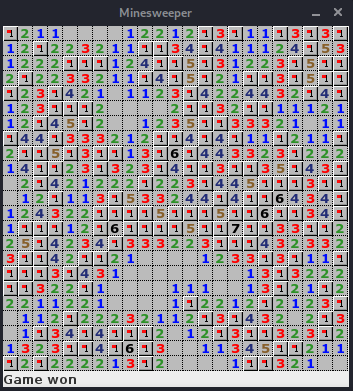
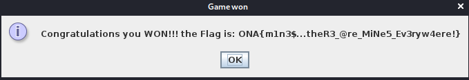

# WriteUp Challenge Lvl3 – Onapsis Lockdown Game2020 - CTF

> Autor: [Rolly Sánchez](https://twitter.com/Pwnakil)

Challenge
========

> A classic. Who did not play MineSweeper in their lives.

> I just wish there weren't so many mines! And in such a small space. But the only way to get the flag is to solve it this way


Análisis
========

Después de descomprimir el reto Lvl3.7z, encontramos un archivo  `MineSweeper.jar`.

Ejecutamos el programa.

```
java -jar MineSweeper.jar  
```


Jugué y perdí altoque xD



Sabemos que es un archivo `.jar`, se deduce que el programa está hecho en `java`, entonces necesitamos descompilar el programar y ver que encontramos. Para descompilar podemos utilizar este programa [Java Decompiler (JD-GUI)](http://java-decompiler.github.io/) o usar esta página web [Java Decompilers](http://www.javadecompilers.com/)

Yo opté por la 2da opción, subí el archivo `MineSweeper.jar` y luego baje el zip con el código ya descompilado.

En este zip hay varios archivos.



Abrimos el archivo `MineSweeper.java` y vemos que este llama a la clase `Board.java`.

```Java
package game;

import java.awt.Component;
import java.awt.EventQueue;
import javax.swing.JFrame;
import javax.swing.JLabel;

public class Minesweeper extends JFrame {
   private JLabel a = new JLabel("");

   public Minesweeper() {
      this.add(this.a, "South");
      this.add(new Board(this.a));
      this.setResizable(false);
      this.pack();
      this.setTitle("Minesweeper");
      this.setLocationRelativeTo((Component)null);
      this.setDefaultCloseOperation(3);
   }

   public static void main(String[] var0) {
      EventQueue.invokeLater(new d());
   }
}

```

Analizamos `Board.java` y vemos algunas cosas interesantes, como las constantes donde nos indican el número de imágenes que se están utilizando, el número de minas, los field, imágenes, funciones que contienen la lógica del juego.

```Java
package game;

...(code)...

public class Board extends JPanel {
   private final int NUM_IMAGES = 13;
   private final int CELL_SIZE = 15;
   private final int COVER_FOR_CELL = 10;
   private final int MARK_FOR_CELL = 10;
   private final int EMPTY_CELL = 0;
   private final int MINE_CELL = 9;
   private final int COVERED_MINE_CELL = 19;
   private final int MARKED_MINE_CELL = 29;
   private final int DRAW_MINE = 9;
   private final int DRAW_COVER = 10;
   private final int DRAW_MARK = 11;
   private final int DRAW_WRONG_MARK = 12;
   private final int N_MINES = 160;
   private final int BOARD_WIDTH = 346;
   private final int BOARD_HEIGHT = 346;
   private int[] field;
   private boolean inGame;
   private int minesLeft;
   private Image[] img;
   private e utils;
   private int allCells;
   private final JLabel statusbar;

   public Board(JLabel var1) {
      this.statusbar = var1;
      this.a();
   }

   private void a() {
      this.setPreferredSize(new Dimension(346, 346));
      this.img = new Image[13];

      for(int var1 = 0; var1 < 13; ++var1) {
         this.img[var1] = (new ImageIcon(this.getClass().getClassLoader().getResource("resources/" + var1 + ".png"))).getImage();
      }

      this.addMouseListener(new c(this, (byte)0));
      this.b();
   }

   private void b() {
      Random var2 = new Random();
      this.utils = new e();
      this.inGame = true;
      this.minesLeft = 160;
      this.allCells = 529;
      this.field = new int[this.allCells];

      int var3;
      for(var3 = 0; var3 < this.allCells; ++var3) {
         this.field[var3] = 10;
      }

      this.statusbar.setText(Integer.toString(this.minesLeft));
      var3 = 0;

      while(var3 < 160) {
         ...(code)...
      }

   }

   ...(code)...
   
   public void paintComponent(Graphics var1) {
      
      ...(code)...

      if ((var2 == 0 || var6) && this.inGame) {
         this.inGame = false;
         this.statusbar.setText("Game won");
         SwingUtilities.invokeLater(new a(this));
      } else {
         if (!this.inGame) {
            this.statusbar.setText("Game lost");
            SwingUtilities.invokeLater(new b(this));
         }

      }
   }

}
```
Nos percatamos que el contsructor de la clase `Board` llama a la función sin retorno `a()`, esta función es la que genera la matriz de imágenes para más adelante match'ear la imagen a los botoncitos del juego cuando es clickeado, en total son 13 imágenes.



Vemos que la imagen 9.png pertenece a la mina y el botón 11 pertenece a la banderita roja(los que han jugado buscaminas sabrán para qué sirve xD!!!).

Y también vemos que dicha función `a()` llama a la función `b()`

```Java
   private void b() {
      Random var2 = new Random();
      this.utils = new e();
      this.inGame = true;
      this.minesLeft = 160;
      this.allCells = 529;
      this.field = new int[this.allCells];

      int var3;
      for(var3 = 0; var3 < this.allCells; ++var3) {
         this.field[var3] = 10;
      }

      this.statusbar.setText(Integer.toString(this.minesLeft));
      var3 = 0;

      while(var3 < 160) {
         ...(code)...
      }

   }
```
Esta función al parecer es la que genera toda las celdas (529) e inicialmente setea con un valor de 10 a cada botoncito y que también asigna las 160 minas que debe haber en el juego y todo ello lo guarda en el vector `field`. 

Y encontramos también una función con un nombre interesante llamado `paintComponent()` donde a ciertas condiciones te dice si perdiste o ganaste, por el nombre y el parámetro que recibe podemos deducir que esta función es la que crea o pinta los botoncitos del juego con sus valores respectivos.

```Java
   public void paintComponent(Graphics var1) {
      
      ...(code)...

      if ((var2 == 0 || var6) && this.inGame) {
         this.inGame = false;
         this.statusbar.setText("Game won");
         SwingUtilities.invokeLater(new a(this));
      } else {
         if (!this.inGame) {
            this.statusbar.setText("Game lost");
            SwingUtilities.invokeLater(new b(this));
         }

      }
   }
```

Obviamente revisé más cosas del código para entender como funciona el juego o ver si el flag estaba en duro y legible, pero creo que con esta introducción es suficiente para lo que les voy a demostrar y así obtener el flag.

Conclusión
========

1. Sabemos que en la matriz `field` tiene todo los botones del juego con sus valores respectivos.
2. Sabemos la distribución de nombres de las imágenes con el valor que sea asignara a los botones del juego.
3. Sabemos que la clase `Board` inicializa y genera la matriz de botones para el juego.
4. La función `paintComponent()` pinta los botones con sus valores respectivos.

Solución
========

Para resolver este reto, lo que haremos es debuguear el juego, dumpear y cambiar algunas variables y así obtener el flag. Para ello utilizaremos `jdb`.

Abrimos una consola y escribimos lo siguiente, lo que hará es poner en un puerto escuchar la ejecución del archivo `MineSweeper.jar`

```
java -agentlib:jdwp=transport=dt_socket,address=8000,server=y,suspend=y -jar MineSweeper.jar
```

Luego en otra consola nos conectamos al puerto que está en escucha utilizando `jdb`.

```
jdb -connect com.sun.jdi.SocketAttach:port=8000
```

Sabemos que la función `paintComponent()` es la que pinta los botones del tablero y que eso valores vienen de la variable `field` de la clase `Board`, entonces lo que vamos a hacer es poner un breakpoint a la función mencionada, lo hacemos de esta manera:

```
main[1] stop in game.Board.paintComponent
```

Luego le damos `run` para que el juego se ejecute hasta que entre a un breakpoint o un watch de una variable.

Y entra al breakpoint que pusimos y nos sale el siguiente mensaje y el formulario sin pintar los botoncitos:

```
> Set deferred breakpoint game.Board.paintComponent

Breakpoint hit: "thread=AWT-EventQueue-0", game.Board.paintComponent(), line=-1 bci=0

```


En este punto muchas variables se ha inicializado y llenados con sus valores respectivos, entre ellas  `field`, vamos a dumpearlo.

```
AWT-EventQueue-0[1] dump this.field
 this.field = {
19, 12, 11, 11, 10, 10, 10, 10, 11, 12, 12, 11, 12, 19, 13, 19, 11, 11, 19, 13, 19, 13, 19, 11, 12, 19, 12, 12, 13, 12, 11, 11, 19, 19, 13, 14, 19, 14, 11, 11, 11, 12, 14, 19, 15, 13, 11, 12, 12, 12, 19, 19, 19, 11, 12, 14, 19, 19, 15, 19, 13, 11, 12, 12, 13, 19, 15, 19, 19, 12, 19, 12, 12, 13, 13, 12, 11, 11, 19, 14, 19, 15, 19, 12, 11, 19, 19, 13, 19, 15, 19, 19, 19, 12, 13, 19, 14, 12, 11, 10, 11, 11, 12, 13, 19, 14, 12, 12, 14, 14, 13, 12, 19, 14, 19, 11, 12, 13, 19, 19, 19, 12, 10, 10, 10, 10, 12, 19, 19, 13, 12, 19, 19, 11, 11, 11, 12, 11, 11, 12, 19, 14, 15, 19, 12, 10, 10, 11, 12, 13, 15, 19, 19, 13, 13, 13, 12, 11, 10, 11, 11, 19, 14, 14, 19, 13, 13, 13, 12, 11, 12, 19, 19, 14, 19, 14, 19, 11, 11, 19, 12, 11, 11, 19, 12, 19, 19, 15, 19, 13, 19, 19, 11, 13, 19, 16, 19, 14, 14, 13, 13, 12, 13, 19, 12, 12, 12, 11, 14, 19, 19, 12, 13, 19, 13, 12, 13, 19, 14, 19, 19, 13, 19, 19, 13, 15, 19, 14, 13, 19, 10, 12, 19, 14, 12, 11, 12, 12, 12, 19, 12, 12, 13, 19, 14, 14, 15, 19, 19, 19, 13, 19, 19, 10, 11, 12, 19, 11, 11, 13, 19, 15, 13, 13, 12, 14, 14, 19, 14, 19, 19, 16, 14, 13, 14, 19, 11, 12, 14, 13, 12, 12, 19, 19, 19, 19, 15, 19, 19, 19, 15, 19, 19, 16, 19, 19, 13, 14, 19, 11, 19, 19, 19, 11, 12, 19, 16, 19, 19, 19, 19, 15, 19, 19, 17, 19, 19, 13, 13, 19, 19, 12, 12, 15, 19, 14, 12, 13, 14, 19, 13, 13, 13, 12, 12, 13, 19, 19, 19, 14, 13, 12, 13, 13, 12, 13, 19, 19, 14, 12, 19, 19, 12, 11, 10, 10, 10, 10, 11, 12, 13, 13, 19, 13, 19, 11, 11, 19, 19, 19, 19, 13, 19, 14, 13, 11, 10, 10, 10, 10, 10, 10, 10, 10, 11, 13, 19, 13, 12, 12, 12, 19, 19, 13, 12, 12, 19, 11, 10, 10, 10, 10, 11, 11, 11, 10, 10, 11, 13, 19, 12, 11, 19, 12, 12, 12, 11, 11, 12, 12, 11, 10, 10, 10, 10, 11, 19, 12, 12, 11, 12, 19, 12, 11, 12, 13, 19, 10, 11, 11, 12, 19, 12, 12, 12, 13, 12, 11, 11, 12, 19, 13, 19, 14, 13, 12, 10, 12, 19, 13, 10, 11, 19, 13, 14, 19, 14, 19, 19, 19, 12, 10, 11, 12, 19, 13, 19, 19, 13, 12, 13, 19, 12, 11, 13, 12, 13, 19, 19, 14, 19, 16, 19, 13, 10, 10, 11, 11, 13, 14, 15, 19, 19, 12, 11, 11, 19, 12, 19, 12, 12, 12, 12, 11, 13, 19, 12, 10, 10, 10, 10, 11, 19, 19, 13, 12, 11, 10, 10
}
```
Vemos que `field` es un vector con todo los valores del tablero y el rango de los valores es de 10 a 19, pensándolo un poco, por lo mencionado líneas arriba y estando probando por un tiempo me di cuenta de que los valores corresponden al nombre de las imágenes(sin extensión) + 10.


Entonces quiere decir que la mina tendría el valor de `19 = 9[.png] + 10` y que la bandera sería `21 = 11[.png] + 10`

Sabiendo esto, cambiaremos los valores del vector `field`, específicamente el valor de la `mina(19)` por la `bandera(21)`, para ello hice un script `setvar.py` para que me genere la instrucción correcta para pegarlo en la consola de `jdb`.

En la variable `field` del script ponemos el vector que dumpeamos anteriormente.

```Python
field = [19, 12, 11, 11, 10, 10, 10, 10, 11, 12, 12, 11, 12, 19, 13, 19, 11, 11, 19, 13, 19, 13, 19, 11, 12, 19, 12, 12, 13, 12, 11, 11, 19, 19, 13, 14, 19, 14, 11, 11, 11, 12, 14, 19, 15, 13, 11, 12, 12, 12, 19, 19, 19, 11, 12, 14, 19, 19, 15, 19, 13, 11, 12, 12, 13, 19, 15, 19, 19, 12, 19, 12, 12, 13, 13, 12, 11, 11, 19, 14, 19, 15, 19, 12, 11, 19, 19, 13, 19, 15, 19, 19, 19, 12, 13, 19, 14, 12, 11, 10, 11, 11, 12, 13, 19, 14, 12, 12, 14, 14, 13, 12, 19, 14, 19, 11, 12, 13, 19, 19, 19, 12, 10, 10, 10, 10, 12, 19, 19, 13, 12, 19, 19, 11, 11, 11, 12, 11, 11, 12, 19, 14, 15, 19, 12, 10, 10, 11, 12, 13, 15, 19, 19, 13, 13, 13, 12, 11, 10, 11, 11, 19, 14, 14, 19, 13, 13, 13, 12, 11, 12, 19, 19, 14, 19, 14, 19, 11, 11, 19, 12, 11, 11, 19, 12, 19, 19, 15, 19, 13, 19, 19, 11, 13, 19, 16, 19, 14, 14, 13, 13, 12, 13, 19, 12, 12, 12, 11, 14, 19, 19, 12, 13, 19, 13, 12, 13, 19, 14, 19, 19, 13, 19, 19, 13, 15, 19, 14, 13, 19, 10, 12, 19, 14, 12, 11, 12, 12, 12, 19, 12, 12, 13, 19, 14, 14, 15, 19, 19, 19, 13, 19, 19, 10, 11, 12, 19, 11, 11, 13, 19, 15, 13, 13, 12, 14, 14, 19, 14, 19, 19, 16, 14, 13, 14, 19, 11, 12, 14, 13, 12, 12, 19, 19, 19, 19, 15, 19, 19, 19, 15, 19, 19, 16, 19, 19, 13, 14, 19, 11, 19, 19, 19, 11, 12, 19, 16, 19, 19, 19, 19, 15, 19, 19, 17, 19, 19, 13, 13, 19, 19, 12, 12, 15, 19, 14, 12, 13, 14, 19, 13, 13, 13, 12, 12, 13, 19, 19, 19, 14, 13, 12, 13, 13, 12, 13, 19, 19, 14, 12, 19, 19, 12, 11, 10, 10, 10, 10, 11, 12, 13, 13, 19, 13, 19, 11, 11, 19, 19, 19, 19, 13, 19, 14, 13, 11, 10, 10, 10, 10, 10, 10, 10, 10, 11, 13, 19, 13, 12, 12, 12, 19, 19, 13, 12, 12, 19, 11, 10, 10, 10, 10, 11, 11, 11, 10, 10, 11, 13, 19, 12, 11, 19, 12, 12, 12, 11, 11, 12, 12, 11, 10, 10, 10, 10, 11, 19, 12, 12, 11, 12, 19, 12, 11, 12, 13, 19, 10, 11, 11, 12, 19, 12, 12, 12, 13, 12, 11, 11, 12, 19, 13, 19, 14, 13, 12, 10, 12, 19, 13, 10, 11, 19, 13, 14, 19, 14, 19, 19, 19, 12, 10, 11, 12, 19, 13, 19, 19, 13, 12, 13, 19, 12, 11, 13, 12, 13, 19, 19, 14, 19, 16, 19, 13, 10, 10, 11, 11, 13, 14, 15, 19, 19, 12, 11, 11, 19, 12, 19, 12, 12, 12, 12, 11, 13, 19, 12, 10, 10, 10, 10, 11, 19, 19, 13, 12, 11, 10, 10]

cont = 0
for i in field:
    if(i==19):
        print "set this.field["+str(cont)+"]=21"
    cont +=1
```

Ejecutamos el script en python y esto es lo que nos arroja:

```
set this.field[0]=21
set this.field[13]=21
set this.field[15]=21
set this.field[18]=21
set this.field[20]=21
set this.field[22]=21
set this.field[25]=21
set this.field[32]=21
set this.field[33]=21
set this.field[36]=21
set this.field[43]=21
set this.field[50]=21
set this.field[51]=21
set this.field[52]=21
set this.field[56]=21
set this.field[57]=21
set this.field[59]=21
set this.field[65]=21
set this.field[67]=21
set this.field[68]=21
set this.field[70]=21
set this.field[78]=21
set this.field[80]=21
set this.field[82]=21
set this.field[85]=21
set this.field[86]=21
set this.field[88]=21
set this.field[90]=21
set this.field[91]=21
set this.field[92]=21
set this.field[95]=21
set this.field[104]=21
set this.field[112]=21
set this.field[114]=21
set this.field[118]=21
set this.field[119]=21
set this.field[120]=21
set this.field[127]=21
set this.field[128]=21
set this.field[131]=21
set this.field[132]=21
set this.field[140]=21
set this.field[143]=21
set this.field[151]=21
set this.field[152]=21
set this.field[161]=21
set this.field[164]=21
set this.field[171]=21
set this.field[172]=21
set this.field[174]=21
set this.field[176]=21
set this.field[179]=21
set this.field[183]=21
set this.field[185]=21
set this.field[186]=21
set this.field[188]=21
set this.field[190]=21
set this.field[191]=21
set this.field[194]=21
set this.field[196]=21
set this.field[203]=21
set this.field[209]=21
set this.field[210]=21
set this.field[213]=21
set this.field[217]=21
set this.field[219]=21
set this.field[220]=21
set this.field[222]=21
set this.field[223]=21
set this.field[226]=21
set this.field[229]=21
set this.field[232]=21
set this.field[239]=21
set this.field[243]=21
set this.field[247]=21
set this.field[248]=21
set this.field[249]=21
set this.field[251]=21
set this.field[252]=21
set this.field[256]=21
set this.field[260]=21
set this.field[267]=21
set this.field[269]=21
set this.field[270]=21
set this.field[275]=21
set this.field[282]=21
set this.field[283]=21
set this.field[284]=21
set this.field[285]=21
set this.field[287]=21
set this.field[288]=21
set this.field[289]=21
set this.field[291]=21
set this.field[292]=21
set this.field[294]=21
set this.field[295]=21
set this.field[298]=21
set this.field[300]=21
set this.field[301]=21
set this.field[302]=21
set this.field[305]=21
set this.field[307]=21
set this.field[308]=21
set this.field[309]=21
set this.field[310]=21
set this.field[312]=21
set this.field[313]=21
set this.field[315]=21
set this.field[316]=21
set this.field[319]=21
set this.field[320]=21
set this.field[324]=21
set this.field[329]=21
set this.field[336]=21
set this.field[337]=21
set this.field[338]=21
set this.field[346]=21
set this.field[347]=21
set this.field[350]=21
set this.field[351]=21
set this.field[362]=21
set this.field[364]=21
set this.field[367]=21
set this.field[368]=21
set this.field[369]=21
set this.field[370]=21
set this.field[372]=21
set this.field[386]=21
set this.field[391]=21
set this.field[392]=21
set this.field[396]=21
set this.field[409]=21
set this.field[412]=21
set this.field[426]=21
set this.field[431]=21
set this.field[436]=21
set this.field[441]=21
set this.field[450]=21
set this.field[452]=21
set this.field[458]=21
set this.field[462]=21
set this.field[465]=21
set this.field[467]=21
set this.field[468]=21
set this.field[469]=21
set this.field[474]=21
set this.field[476]=21
set this.field[477]=21
set this.field[481]=21
set this.field[487]=21
set this.field[488]=21
set this.field[490]=21
set this.field[492]=21
set this.field[501]=21
set this.field[502]=21
set this.field[506]=21
set this.field[508]=21
set this.field[515]=21
set this.field[522]=21
set this.field[523]=21
```

Copiamos y pegamos en la consola de `jdb`.

```
AWT-EventQueue-0[1]  this.field[22]=21 = 21
AWT-EventQueue-0[1] AWT-EventQueue-0[1]  this.field[15]=21 = 21
AWT-EventQueue-0[1]  this.field[20]=21 = 21
AWT-EventQueue-0[1]  this.field[18]=21 = 21
.
.
.
AWT-EventQueue-0[1] AWT-EventQueue-0[1]  this.field[88]=21 = 21
AWT-EventQueue-0[1]  this.field[82]=21 = 21
AWT-EventQueue-0[1]  this.field[85]=21 = 21
 this.field[104]=21 = 21
AWT-EventQueue-0[1]  this.field[92]=21 = 21
.
.
.
 this.field[171]=21 = 21
AWT-EventQueue-0[1] AWT-EventQueue-0[1]  this.field[287]=21 = 21
 this.field[226]=21 = 21
AWT-EventQueue-0[1]  this.field[289]=21 = 21
 this.field[95]=21 = 21
 this.field[260]=21 = 21
 this.field[203]=21 = 21
.
.
.
AWT-EventQueue-0[1] AWT-EventQueue-0[1]  this.field[426]=21 = 21
AWT-EventQueue-0[1]  this.field[431]=21 = 21
AWT-EventQueue-0[1]  this.field[436]=21 = 21
AWT-EventQueue-0[1]  this.field[452]=21 = 21
 this.field[450]=21 = 21
AWT-EventQueue-0[1]  this.field[441]=21 = 21
.
.
.
 this.field[502]=21 = 21
AWT-EventQueue-0[1] AWT-EventQueue-0[1]  this.field[515]=21 = 21
AWT-EventQueue-0[1]  this.field[506]=21 = 21
AWT-EventQueue-0[1]  this.field[522]=21 = 21
```

Y para verificar que el cambio es correcto, hacemos un dump de la variable `field`:

```
AWT-EventQueue-0[1] dump this.field
 this.field = {
21, 12, 11, 11, 10, 10, 10, 10, 11, 12, 12, 11, 12, 21, 13, 21, 11, 11, 21, 13, 21, 13, 21, 11, 12, 21, 12, 12, 13, 12, 11, 11, 21, 21, 13, 14, 21, 14, 11, 11, 11, 12, 14, 21, 15, 13, 11, 12, 12, 12, 21, 21, 21, 11, 12, 14, 21, 21, 15, 21, 13, 11, 12, 12, 13, 21, 15, 21, 21, 12, 21, 12, 12, 13, 13, 12, 11, 11, 21, 14, 21, 15, 21, 12, 11, 21, 21, 13, 21, 15, 21, 21, 21, 12, 13, 21, 14, 12, 11, 10, 11, 11, 12, 13, 21, 14, 12, 12, 14, 14, 13, 12, 21, 14, 21, 11, 12, 13, 21, 21, 21, 12, 10, 10, 10, 10, 12, 21, 21, 13, 12, 21, 21, 11, 11, 11, 12, 11, 11, 12, 21, 14, 15, 21, 12, 10, 10, 11, 12, 13, 15, 21, 21, 13, 13, 13, 12, 11, 10, 11, 11, 21, 14, 14, 21, 13, 13, 13, 12, 11, 12, 21, 21, 14, 21, 14, 21, 11, 11, 21, 12, 11, 11, 21, 12, 21, 21, 15, 21, 13, 21, 21, 11, 13, 21, 16, 21, 14, 14, 13, 13, 12, 13, 21, 12, 12, 12, 11, 14, 21, 21, 12, 13, 21, 13, 12, 13, 21, 14, 21, 21, 13, 21, 21, 13, 15, 21, 14, 13, 21, 10, 12, 21, 14, 12, 11, 12, 12, 12, 21, 12, 12, 13, 21, 14, 14, 15, 21, 21, 21, 13, 21, 21, 10, 11, 12, 21, 11, 11, 13, 21, 15, 13, 13, 12, 14, 14, 21, 14, 21, 21, 16, 14, 13, 14, 21, 11, 12, 14, 13, 12, 12, 21, 21, 21, 21, 15, 21, 21, 21, 15, 21, 21, 16, 21, 21, 13, 14, 21, 11, 21, 21, 21, 11, 12, 21, 16, 21, 21, 21, 21, 15, 21, 21, 17, 21, 21, 13, 13, 21, 21, 12, 12, 15, 21, 14, 12, 13, 14, 21, 13, 13, 13, 12, 12, 13, 21, 21, 21, 14, 13, 12, 13, 13, 12, 13, 21, 21, 14, 12, 21, 21, 12, 11, 10, 10, 10, 10, 11, 12, 13, 13, 21, 13, 21, 11, 11, 21, 21, 21, 21, 13, 21, 14, 13, 11, 10, 10, 10, 10, 10, 10, 10, 10, 11, 13, 21, 13, 12, 12, 12, 21, 21, 13, 12, 12, 21, 11, 10, 10, 10, 10, 11, 11, 11, 10, 10, 11, 13, 21, 12, 11, 21, 12, 12, 12, 11, 11, 12, 12, 11, 10, 10, 10, 10, 11, 21, 12, 12, 11, 12, 21, 12, 11, 12, 13, 21, 10, 11, 11, 12, 21, 12, 12, 12, 13, 12, 11, 11, 12, 21, 13, 21, 14, 13, 12, 10, 12, 21, 13, 10, 11, 21, 13, 14, 21, 14, 21, 21, 21, 12, 10, 11, 12, 21, 13, 21, 21, 13, 12, 13, 21, 12, 11, 13, 12, 13, 21, 21, 14, 21, 16, 21, 13, 10, 10, 11, 11, 13, 14, 15, 21, 21, 12, 11, 11, 21, 12, 21, 12, 12, 12, 12, 11, 13, 21, 12, 10, 10, 10, 10, 11, 21, 21, 13, 12, 11, 10, 10
}
```

Luego procedemos a quitar el breakpoint puesto anteriormente

```
AWT-EventQueue-0[1] clear game.Board.paintComponent         
Removed: breakpoint game.Board.paintComponent
```

Le damos `run` y no sale el tablero ya marcados las minas.



Solo faltaría clickar en todo los botones (menos en las banderas, tampoco se puede) y happy hacking!!!


Your Flag
========





PD: Sé que no es la única manera de solucionar este reto pero es la que yo encontré, espero sus feedback's.