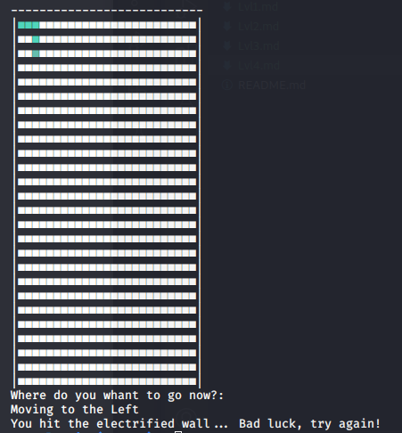
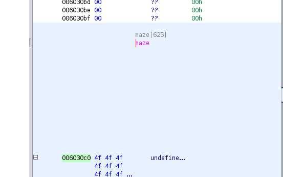
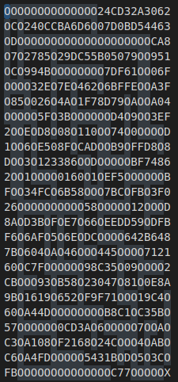
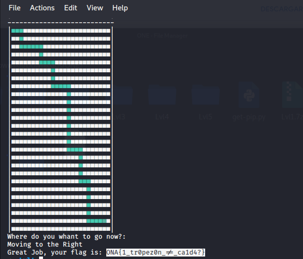

# WriteUp Challenge Lvl4 – Onapsis Lockdown Game2020 - CTF

> Autor: [Rolly Sánchez](https://twitter.com/Pwnakil)

Challenge
========

> We built a maze so that you can not continue.
Exit this maze and you will find the flag you are looking for!

> Developers say it's easy, but is harder when you can't see where you are going, and a monster is looking for you


Análisis
========

Después de descomprimir el reto Lvl4.7z, encontramos un archivo  `MazeRuner`.

Ejecutamos el programa.

```
./MazeRuner  
```
```
Welcome to the Invisible Maze!!!
If you reach the end of this puzzle, you will receive the Flag that you are looking for... But just to make things harder, the walls of this Maze are electrified, so try not to hit any of them jajajaja

 To move arround the Maze, chose the direction you want to go and press ENTER
Up: w
Down: s
Left: a
Right: d

Hit Enter to start...
```


Nuevamente jugué y perdí xD

Hay que ver que tipo de archivo es con `file`

```
MazeRuner: ELF 64-bit LSB executable, x86-64, version 1 (SYSV), dynamically linked, interpreter /lib64/ld-linux-x86-64.so.2, for GNU/Linux 2.6.32, BuildID[sha1]=5726c86485f48619a794d4286801e8b450d5194f, not stripped
```

Vemos que es un binario, procedemos a descompilar con [Ghidra](https://ghidra-sre.org/)

buscamos `main` y nos encontramos con estas líneas de código

```C++
undefined8 main(int param_1,long param_2)

{
  int iVar1;
  long in_FS_OFFSET;
  char local_28 [16];
  char local_18 [8];
  long local_10;
  
  local_10 = *(long *)(in_FS_OFFSET + 0x28);
  strcpy(local_18,_STR_DEV);
  if (1 < param_1) {
    strcpy(local_28,*(char **)(param_2 + 8));
    iVar1 = strncmp(local_28,OPT,6);
    if (iVar1 == 0) {
      if (local_18[0] == 'T') {
        _SYS_DEV_SIGN = 1;
      }
      else {
        puts("Not Allowed...");
      }
    }
  }
  puts(
      "Welcome to the Invisible Maze!!!\nIf you reach the end of this puzzle, you will receive theFlag that you are looking for... But just to make things harder, the walls of this Maze areelectrified, so try not to hit any of them jajajaja"
      );
  puts(
      "\n To move arround the Maze, chose the direction you want to go and press ENTER\nUp:w\nDown: s\nLeft: a\nRight: d\n"
      );
  printf("Hit Enter to start...");
  getchar();
  clrScreen();
  play();
  if (local_10 != *(long *)(in_FS_OFFSET + 0x28)) {
                    /* WARNING: Subroutine does not return */
    __stack_chk_fail();
  }
  return 0;
}
```
Encontramos funciones como `getchar()`, `clrScreen()` y `play()`, este último es lo que nos debe interesar porque contiene la lógica del programa, así que miramos que es lo que contiene está función.

```C++
void play(void)

{
  int iVar1;
  long in_FS_OFFSET;
  uint local_a2c;
  uint local_a28;
  int local_a24;
  int local_a20;
  uint local_a1c;
  undefined4 local_a18 [628];
  undefined local_48 [56];
  long local_10;
  
  local_10 = *(long *)(in_FS_OFFSET + 0x28);
  local_a24 = 0;
  while (local_a24 < 0x19) {
    local_a20 = 0;
    while (local_a20 < 0x19) {
      local_a18[(long)local_a24 * 0x19 + (long)local_a20] = 0;
      local_a20 = local_a20 + 1;
    }
    local_a24 = local_a24 + 1;
  }
  local_a18[0] = 1;
  local_a2c = 0;
  local_a28 = 0;
  local_a1c = 0;
  while ((int)local_a1c < 0x30) {
    iVar1 = lookPosition((ulong)local_a2c,(ulong)local_a28,(ulong)local_a1c,local_48);
    if (iVar1 == 0) break;
    clrScreen();
    printPath((ulong)local_a2c,(ulong)local_a28,(ulong)local_a1c,local_a18);
    local_a1c = move((ulong)local_a1c,&local_a2c,&local_a28,local_a18);
  }
  winner((ulong)local_a2c,(ulong)local_a28,(ulong)local_a1c,local_48);
  if (local_10 != *(long *)(in_FS_OFFSET + 0x28)) {
                    /* WARNING: Subroutine does not return */
    __stack_chk_fail();
  }
  return;
}
```
Observamos que hay 2 while's y que después se hace una llamada a la función `winner()`, le damos una chequeada.

```C++
undefined8 winner(int param_1,int param_2,int param_3,undefined8 param_4)

{
  undefined8 uVar1;
  
  if (maze[(long)param_2 * 0x19 + (long)param_1] == 'X') {
    printFlag(param_4);
    uVar1 = 1;
  }
  else {
    if (param_3 == 0x30) {
      puts(
          "Oh no,the maze monster find you... Bad luck, try again using less steps, dont wonderarround the maze!"
          );
    }
    else {
      puts("You hit the electrified wall... Bad luck, try again!");
    }
    uVar1 = 0;
  }
  return uVar1;
}
```
Vemos que hay una constante `maze` que no se puede acceder y por lo tanto no es visible su valor en el `Ghidra`, pero podemos tener una referencia a su dirección en memoria que es `0x006030c0`



También observamos que sí su valor es igual `X` nos pinta el flag `printFlag()` o en caso contrario un mensaje indicándonos que hemos perdido en el juego. Así que miramos que es lo que hace esta función.

```C++
void printFlag(long param_1)

{
  long lVar1;
  int __c;
  long in_FS_OFFSET;
  uint local_1c;
  char local_18;
  
  lVar1 = *(long *)(in_FS_OFFSET + 0x28);
  printf("Great Job, your flag is: ");
  if (_SYS_DEV_SIGN == 0) {
    local_1c = 0;
    while ((int)local_1c < 0x30) {
      if ((local_1c & 1) == 0) {
        local_18 = *(char *)(param_1 + (int)local_1c);
      }
      else {
        __c = hex_to_ascii((ulong)(uint)(int)local_18,
                           (ulong)(uint)(int)*(char *)(param_1 + (int)local_1c),
                           (ulong)(uint)(int)*(char *)(param_1 + (int)local_1c));
        putchar(__c);
      }
      local_1c = local_1c + 1;
    }
    puts("}");
  }
  else {
    puts("<place_info_in_product_version>");
  }
  if (lVar1 != *(long *)(in_FS_OFFSET + 0x28)) {
                    /* WARNING: Subroutine does not return */
    __stack_chk_fail();
  }
  return;
}
```

Esta función recibe un parámetro de tipo `long` y con ello hace ciertas operaciones para obtener el flag, entonces una de las soluciones podría ser replicar esta función e iterar hasta cierta cantidad, dependiendo del análisis que se hace para asignarle un rango y luego buscar con `grep` algún string legible o buscar `ONA`, `ona`, etc.


Conclusión
========

1. Sabemos que existe una función `winner()`.
2. Conocemos la función que pinta el flag `printFlag()`.
3. Vimos que una constante de tipo vector `maze` sí su valor es `X` nos da el flag, pensando un poco en ese valor, es como si fuera el final del laberinto.

Solución
========

Lo que vamos a hacer es debuguear este programa y dumpear variables, para ello usaremos `gdb`.

> He intentado usar [gdb-peda](https://github.com/longld/peda) pero cuando se debuguea y llega a esta función `clrScreen()`, hace que se caiga el debug del proceso principal, al parecer se debe que esta función ejecuta un `system("clear");` y este genera otro proceso y el `gdb-peda` sigue a este nuevo proceso y no se queda en la principal, no encontre alguna solución así que decidí utilizar solo `gdb`, si alguien sabe algo sobre este punto, háganmelo saber :D.

Debugueamos el programa con `gdb`.

```
gdb MazeRuner
```

Vamos a poner un breakpoint en `winner()`.

```
(gdb) break winner
Breakpoint 1 at 0x4011f6
```

Le damos `run` y para que salte este breakpoint vamos a perder a propósito en el juego y luego le damos `ctrl+c`.

Ahora vamos a buscar la constante `maze` para saber que cosa exactamente es o que almacena.

```
(gdb) info var maze
All variables matching regular expression "maze":

Non-debugging symbols:
0x00000000006030c0  maze
```

Vemos que si encuentra la constante que estamos buscando y si se percatan la dirección de memoria que se muestra es la misma que  el `ghidra` nos mostró `0x006030c0 = 0x00000000006030c0`.

Procedemos a dumpear esa constante  en formato string de esta forma.

```
(gdb) x/40s 0x00000000006030c0
```

Y nos muestra este resultado

```
0x6030c0 <maze>:        'O' <repeats 14 times>, "24CD32A3062OCO240CCBA6D6O07D0BD54463OD", 'O' <repeats 20 times>, "CA8O7O2785O29DC55B05079OO951OCO994BOOOOOOOO7DF61OO06FOOOO32EO7EO462O6BFFEOOA3FO85O026O4AO1F78D79OAOOA04OOOOO5FO3BOOOOOOD4O9OO3EF"...
0x603188 <maze+200>:    "2OOEOD8O08O110OO74O0OOOOD1OO6OE508FOCADOOB9OFFD8O8DOO3O123386OODOOOOOBF74862OO1OOOO0160O1OEF5OOOOOOBFOO34FCO6B58OOO7BCOFBO3F026OOOOOOOOOO58OOOOO12OOOD8AOD3BOFOE7O66OEEDD59ODFBF6O6AFO5O6EODCOOOO642B648"...
0x603250 <maze+400>:    "7BO604OAO46OOO445OOOO712160OC7FOOOOOO98C35O09OOOO2CBOOO93OB58O23047O81O0E8A9BO1619O652OF9F71OOO19C4O60OA44DOOOOOOOOB8C1OC35BO57OOOOOO0CD3AO6OOOOO7OOAOC3OA108OF2168O24COOO4OABOC6OA4FDOOOOO5431BODO5O3CO"...
0x603318 <maze+600>:    "FB", 'O' <repeats 14 times>, "C77OOOOOX4F46A0DAFB779B2439F7BA428FEE747A797051EA50E9F10F0542417B31BA935D7393F469F67E22259A5A8FCA06DDE2A82C0C4959DFAF7471E07C68761CBF51F1190B9AD226A3C7B4FA4BB673CF5DE8283D3518178554A56"...
0x6033e0 <maze+800>:    "B11FE1D2D207065CA77D3D7733BA0225075C88176FDB9AF9B11BE7FF49BD1D4BA83A4779BD5511206EED436143E24B1ED16AF15B4D82DCFB8507B873DC07E742C7CDC508DFD6E6D6094B2B407703B8242E61E96147C7F2D7EE6C975F8A9B85291A9C4F7A"...
0x6034a8 <maze+1000>:   "2B6DE5B519E35EF2139A2EB663B59FF81B137D8106D02C66090971416121790734D54DAA51E7EA63EACF9086710BFF66DD42065F9E5FC580A94BD63635D0C612D1E9E53B333F0E241090835C08D83616E3077BF7B3660C07FFD9102B06C00C3725110910"...
0x603570 <maze+1200>:   "A5D215542BFDB02D09B6FD270306E5F213D5F63613164343F7"
0x6035a3:       ""
```

A simple vista no se entiende que es, pero viéndolo bien me di cuenta que en esa cadena hay una `X`, justo como en el código de la función `winner()` lo señala, entonces vamos a tratar de ordenarlo en un texto plano y ponerlos en columna de `25` hasta la `X`, ¿Por qué 25?, por que tengo la sospecha de que cada letra de esa cadena es un paso del laberinto y el laberinto tiene `25` columnas, así quedaría nuestra cadena:

```
OOOOOOOOOOOOOO24CD32A3062
OCO240CCBA6D6O07D0BD54463
ODOOOOOOOOOOOOOOOOOOOOCA8
O7O2785O29DC55B05079OO951
OCO994BOOOOOOOO7DF61OO06F
OOOO32EO7EO462O6BFFEOOA3F
O85O026O4AO1F78D79OAOOA04
OOOOO5FO3BOOOOOOD4O9OO3EF
2OOEOD8O08O110OO74O0OOOOD
1OO6OE508FOCADOOB9OFFD8O8
DOO3O123386OODOOOOOBF7486
2OO1OOOO0160O1OEF5OOOOOOB
FOO34FCO6B58OOO7BCOFBO3F0
26OOOOOOOOOO58OOOOO12OOOD
8AOD3BOFOE7O66OEEDD59ODFB
F6O6AFO5O6EODCOOOO642B648
7BO604OAO46OOO445OOOO7121
60OC7FOOOOOO98C35O09OOOO2
CBOOO93OB58O23047O81O0E8A
9BO1619O652OF9F71OOO19C4O
60OA44DOOOOOOOOB8C1OC35BO
57OOOOOO0CD3AO6OOOOO7OOAO
C3OA108OF2168O24COOO4OABO
C6OA4FDOOOOO5431BODO5O3CO
FBOOOOOOOOOOOOOOC77OOOOOX
```

Y por lo que vemos, considero que el camino correcto son los `0`, así que solo quedaría seguir el camino de `0` hasta la `X`.



Happy hacking!!! :D


Your Flag
========



