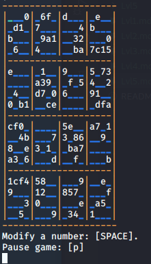
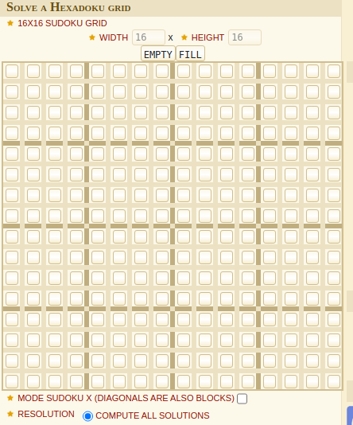
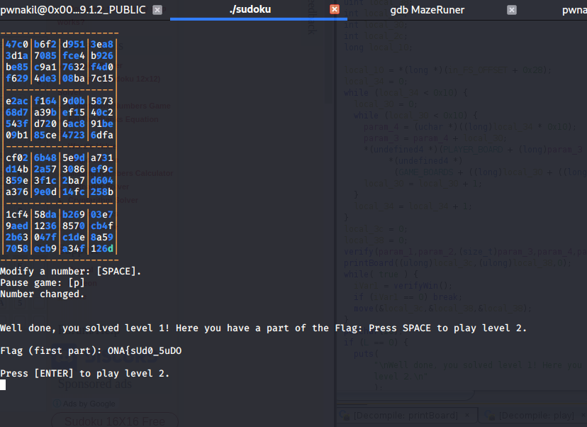
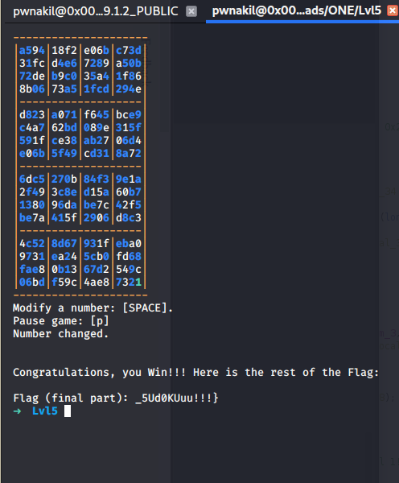

# WriteUp Challenge Lvl5 – Onapsis Lockdown Game2020 - CTF

> Autor: [Rolly Sánchez](https://twitter.com/Pwnakil)

Challenge
========

> Sudoku is my favorite game. You need to test your brain and look for all possibilities.

> Of course, it is even harder if numbers are hexadecimals. Luckily, I'm able to save the game and continue whenever I want


Análisis
========

Después de descomprimir el reto Lvl5.7z, vemos que tenemos un programa `sudoku`

Ejecutamos el programa.



Vemos que es un sudoku hexadecimal.

Verificamos que tipo de archivo es con `file`

```
sudoku: ELF 64-bit LSB executable, x86-64, version 1 (SYSV), dynamically linked, interpreter /lib64/ld-linux-x86-64.so.2, for GNU/Linux 2.6.32, BuildID[sha1]=f8a15a99a7cafd0309813114109fbb81834db888, not stripped
```

Podríamos analizarlo con `Ghidra` y ver la lógica que tiene el programa o resolver el Sudoku. 

Solución
========

Vamos a resolver el sudoku hexadecimal usando una herramienta que encontré en internet [hexadoku-sudoku-16-solver](https://www.dcode.fr/hexadoku-sudoku-16-solver).



Simplemente llenamos los campos en esa herramienta y la herramienta hará la magia :D

Happy hacking!!!

Your Flag
========

Al resolver nos dimos cuenta de que son 2 sudokus hexadecimales a resolver y que cada uno tienen una parte del flag.




Flag:

```
ONA{sUd0_5uDO_5Ud0KUuu!!!}
```
