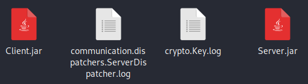

# WriteUp Challenge Lvl6 – Onapsis Lockdown Game2020 - CTF

> Autor: [Rolly Sánchez](https://twitter.com/Pwnakil)

Challenge
========

> Final level. You really are a true gamer! But this is not a simple game It is a Spies game.

> Our Spy Agency released a new software to communicate with agents and assets. It uses encrypted messages to hide what we are saying.

> We know that an enemy hacker recovered this app. He'd been playing around with it and was trying to recover the secret flag.


> Can you find out if he succeeded?
Remember, the flag can be used to open the safe house, containing the final treasure!


Análisis
========

Después de descomprimir el reto Lvl6.7z, vemos los siguientes archivos.



Observamos que hay archivos `.jar`, por lo tanto deducimos que las aplicaciones están desarrollados en `Java`.


Observamos algunos archivos `.log`, los abrimos, en el archivo `communication.dispatchers.ServerDispatcher.log` al parecer tenemos un registro de eventos disparados por el programa `Server.jar` y vemos entre línea que se loguean exitosamente los agentes secretos y piden el flag.

```
Agent -352804511 registered with key uid: 0.8559555939652798 
New message from Agent -352804511. 
New response to Agent -352804511. 
Agent 1080677946 registered with key uid: 0.5379168862598493 
New message from Agent 1080677946. 
New response to Agent 1080677946. 
.
.
. 
Agent -1483375736 registered with key uid: 0.5754347607516737 
New message from Agent -1483375736. 
New response to Agent -1483375736. 
New message from Agent -1483375736. 
New response to Agent -1483375736. 
New message from Agent -1483375736. 
New response to Agent -1483375736. 
New message from Agent -1483375736. 
New response to Agent -1483375736. 
.
.
.
Agent -1461337779 registered with key uid: 0.6737304690230748 
Secret agent -1461337779 login succesful. 
Secret agent -1461337779 has set a new secret key. 
New message from Agent -1461337779. 
New response to Agent -1461337779. 
New message from Agent -1461337779. 
New response to Agent -1461337779. 
New message from Agent -1461337779. 
New response to Agent -1461337779. 
New message from Agent -1461337779. 
New response to Agent -1461337779. 
Flag sent to secret agent -1461337779. 
New message from Agent -1461337779. 
New response to Agent -1461337779. 
```

El otro archivo `cryptoKey.log` parece que tenemos información codificada, que programa lo genera? no lo sabemos.


```
New message from Agent -352804511. Ecnrypted message: wqZUwpECEsOAw5nCm1E= 
New message to Agent -352804511. Ecnrypted message: wq5Zwp8DH8OCw5LCnVXCmMKxScKv 
New message from Agent -352804511. Ecnrypted message: wodtBMOPRH/CrloFXMK4w73CrigaE1/DjcKDbzPCm2jDgxvDksKbehHDnldgwqpQAVbCs8O3wqIoGgFXw4rClX0kwpdsw5kMw5vCkHcKw4VIesKgQgk= 
New message to Agent -352804511. Ecnrypted message: wq9AKQ== 
New message from Agent 1080677946. Ecnrypted message: wqZUwpECEsOAw5nCm1E= 
New message to Agent 1080677946. Ecnrypted message: wq5Zwp8DH8OCw5LCnFHCnMKzScKg 
New message from Agent 1080677946. Ecnrypted message: G8KbM1F2bsOBZVbDhsOew5V7eh3Dr8OxwonCo0vDgGQJYwNTF8KHNl96ZsOTZV7Dl8OVw4V2Zh3Dv8OowpXCuF7Dkm8J 
New message to Agent 1080677946. Ecnrypted message: M8K2Hg== 
.
.
.
New message to Agent -1423600094. Ecnrypted message: RGEB 
New message from Agent -1423600094. Ecnrypted message: bEwsQsKZwr0vR8O0wrfCpMK0w4LDhcKyw6x3GiMuIwjCvsOyw4kKaE0pX8KKwrMnUsOjwqvCo8Knw4HDmcK2w697Bz83IwrCsMOyw4saa0EjQsKFwrE= 
New message to Agent -1423600094. Ecnrypted message: YEw0WcKOwr88WsO8wqbCr8Kmw4/DlsK8w69rByIhMAvCocOqw5gBZkslQ8KK 
New message from Agent -1461337779. Ecnrypted message: wqZUwpECEsOAw5nCm1E= 
New message to Agent -1461337779. Ecnrypted message: wq5Zwp8DH8OCw5PCnljClcK1S8Ki 
.
.
.
CsKVwqTDhCQuwqbDoynCs8ONBMOpw4jDrT8tBzdnwpATw4rDpcKOVGw= 
New message to Agent -1461337779. Ecnrypted message:  
New message from Agent -1461337779. Ecnrypted message: CsKVwqTDhCQuwqbDoynCs8ONBMOpw4jDrT8tBzdnwpATw4rDpcKOVGzDlg== 
New message to Agent -1461337779. Ecnrypted message:  
New message from Agent -1461337779. Ecnrypted message: CsKVwqTDhCQiwpDDpTjCpMOcIMOXw6vDvzsxAjwkw4Z/w4/Dog== 
New message to Agent -1461337779. Ecnrypted message:  
New message from Agent -1461337779. Ecnrypted message: CsKVwqTDhCQuwqbDoynCs8ONBMOpw4jDrT8tBzdnwpATw4rDpcKOHA== 
New message to Agent -1461337779. Ecnrypted message: OMOZw6PDhWZGw4DCvnzDucKcQ8KBw7vDqCk/Ejojw41+w4LDocKEAjjDkcOsw4BgQg== 
.
.
.
New message to Agent -1461337779. Ecnrypted message: RUVUU0FIUF9QWUZLXVJKTFheTVtDVE5FWVpaSENeTkFcW1BRSkxfV0JfQlA= 
New message from Agent -1461337779. Ecnrypted message: VkJeSUxPSkhJU1lDVU1KXV5JTVhYVl5RRkBeWE9aW0FfU1tIXUlPWllOTVE= 
New message to Agent -1461337779. Ecnrypted message: cG56 
```

Ejecutamos los programas `Server.jar` y `Client.jar`

```
java -jar Server.jar

Picked up _JAVA_OPTIONS: -Dawt.useSystemAAFontSettings=on -Dswing.aatext=true
Provide Server Port:
8089
Listening on 0x00:8089 . . .
```

```
java -jar Client.jar     

Picked up _JAVA_OPTIONS: -Dawt.useSystemAAFontSettings=on -Dswing.aatext=true
Wellcome Agent. Chose one of the following actions:
[1] Register to the Agency Messaging Service.
[2] Exit.
Action:
1
Provide Server HostName:
127.0.0.1
Provide Server Port:
8089
HandShake succesful. You are now registered
Chose one of the following actions:
[1] Login as Secret Agent (You will need the secret password).
[2] Send message to the Agency. Remember, only lowercase letters, spaces and the following symbols {}.
[3] Close connection.
[4] Exit.
Action:

```

Como dice el reto, esto es un programa de espías, pues se ve la 1ra opción que es para registrarte como un agente secreto mediante una contraseña y la 2da opción para enviar un mensaje al server.

Después de haber interactuado con los programas, nos dimos cuenta de que los archivos `communication.dispatchers.ServerDispatcher.log` y `cryptoKey.log` se sobreescriben y se generan nuevos registros.

Para entender básicamente que es lo que hace el programa necesitamos descompilar y para ello yo usaré esta página web [Java Decompilers](http://www.javadecompilers.com/), subimos el programa, en este caso yo solo subiré el `Client.jar` y bajamos el `zip` y lo abrimos con un editor.

> PD: He intentado compilar el código bajado pero no he podido, sé que se necesita reconstruir varías cosas, llamar librerías, etc. el cual ya lo vi complicado, tal vez de esa manera hubiese sido más rápido entender todo el flujo del programa y poder sacar rápido el flag.

Buscamos el `main()` del programa y encontramos lo siguiente:

```Java
   public static void main(String[] args) throws IOException, ClassNotFoundException, NoSuchAlgorithmException {
      ClientPlatform platform = null;

      while(true) {
         if (platform != null && !platform.isRegistered()) {
            platform = null;
         }

         if (platform == null) {
            displayInitOptions();
            platform = register();
         }

         if (platform != null && !platform.isSecret()) {
            displayRegisteredOptions();
            platform.registeredActions();
         }

         if (platform != null && platform.isSecret()) {
            displaySecretOptions();
            platform.secretActions();
         }
      }
   }
```

Se ve una serie de condiciones, de acuerdo a ello nos muestra un menú, hay 2 funciones que nos interesa.

`registeredActions()`

```Java
   public void registeredActions() throws UnknownHostException, IOException, ClassNotFoundException, NoSuchAlgorithmException {
      this.getDispatcher().openConnection(this.getServer());
      int action = getRegisteredOption();
      int code;
      switch(action) {
      case 1:
         this.password = Platform.writeRead("Enter your secret password:");
         SecretAgent secretAg = this.getSecretAgent(this.password);
         code = this.getDispatcher().adminLogin(secretAg, this.getServer());
         if (code == 0) {
            Platform.write("Login succesful. You are now registered as a Secret Agent!");
            this.upgradeAgent(this.password);
            this.setSecret(true);
         } else {
            writeErrorMessage(code);
         }
         break;
      case 2:
         String msg = Platform.writeReadMsg();
         msg = this.getDispatcher().communicate(this.getClient(), this.getServer(), msg);
         if (msg != null) {
            Platform.write(msg);
         }
         break;
      case 3:
         code = this.getDispatcher().CloseConnection(this.getClient(), this.getServer());
         if (code == 0) {
            Platform.write("Connection closed. You can register again whenever you want!");
            this.setRegistered(false);
         } else {
            writeErrorMessage(code);
         }
         break;
      case 4:
         Platform.write("Good Bye!");
         this.getDispatcher().closeConnection();
         System.exit(0);
      }

      this.getDispatcher().closeConnection();
   }
```

Aquí vemos que la opción 1 o el caso 1, es el momento donde el agente se loguea, en el código se hace un call a una función `adminLogin()` y dentro de esta función hay otra función llamada `getHashStr()` y dentro de ella hay un hash MD5 `a97d075868437cdeabb692969ba18a63`, este hash debe ser la contraseña del agente, podemos usar un diccionario con `hashcat` para descifrar ese hash pero llevaría tiempo y todo depende de tu diccionario.

Y la otra función `secretActions()`

```Java
   public void secretActions() throws UnknownHostException, IOException, NoSuchAlgorithmException, ClassNotFoundException {
      this.getDispatcher().openConnection(this.getServer());
      int action = getSecretOption();
      int code;
      switch(action) {
      case 1:
         this.getClient().setKey(new Key());
         code = this.getDispatcher().setAgentKey(this.getClient(), this.getServer(), this.getClient().getKey());
         if (code == 0) {
            Platform.write("Key established. All communication will be encrypted with your own Key.");
         } else {
            writeErrorMessage(code);
         }
         break;
      case 2:
         StringBuilder flag = new StringBuilder();
         code = this.getDispatcher().retrieveFlag((SecretAgent)this.getClient(), this.getServer(), flag);
         if (code == 0) {
            Platform.write(flag.toString());
         } else {
            writeErrorMessage(code);
         }
         break;
      case 3:
         String msg = Platform.writeReadMsg();
         msg = this.getDispatcher().communicate(this.getClient(), this.getServer(), msg);
         if (msg != null) {
            Platform.write(msg);
         }
         break;
      case 4:
         code = this.getDispatcher().CloseConnection(this.getClient(), this.getServer());
         if (code == 0) {
            Platform.write("Connection closed. You can register again whenever you want!");
            this.setRegistered(false);
         } else {
            writeErrorMessage(code);
         }
         break;
      case 5:
         Platform.write("Good Bye!");
         this.getDispatcher().closeConnection();
         System.exit(0);
      }

      this.getDispatcher().closeConnection();
   }
```

Observamos que esta función se ejecuta cuando ya eres un agente autentificado, vemos que la opción 1 hace que se genere como una nueva encriptación de nuestra comunicación por que se genera una nueva `key()` y la opción 2 nos da el flag.

Revisando más el código y también interactuando con el programa, nos damos cuenta de que cuando nosotros nos conectamos al server para iniciar una comunicación nos genera un identificador `UID`, ese identificador se utiliza en toda los eventos y comunicaciones que tienes mediante el programa, ante ello, decidí revisar esa parte de código, encontrando esta clase `Key`

```Java
package crypto;

import communication.Message;
import java.io.Serializable;
import java.math.BigInteger;
import java.security.MessageDigest;
import java.security.NoSuchAlgorithmException;
import java.util.Base64;
import java.util.Random;

public class Key implements Serializable {
   private static final long serialVersionUID = 1780996760611862919L;
   private String key;
   private double uid;
   public static final int SIZE = 26;
   private transient long seed;

   public Key() {
      this(System.currentTimeMillis());
   }

   public Key(String key) {
      String extKey = key + "ABCDEFGHIJKLMNOPQRSTUVWXYZ";
      this.key = extKey.substring(0, 26);
      this.uid = -1.0D;
      this.seed = -1L;
   }

   public Key(long seed) {
      this.seed = seed;
      Random r = new Random(seed);
      this.uid = r.nextDouble();
      StringBuilder sb = new StringBuilder();

      for(int i = 0; i < 26; ++i) {
         sb.append((char)((int)(r.nextDouble() * 256.0D)));
      }

      this.key = sb.toString();
   }

   public double getUid() {
      return this.uid;
   }

   public long getSeed() {
      return this.seed;
   }

   public String getKeyStr() {
      return this.key;
   }

   protected String encrypt(String data) {
      data = data.replace(" ", "~");
      data = data.replace(".", "|");
      StringBuilder sb = new StringBuilder();

      for(int i = 0; i < data.length(); ++i) {
         int indx = i % 26;
         char enc = (char)(data.charAt(i) ^ this.key.charAt(indx));
         sb.append(enc);
      }

      return Base64.getEncoder().encodeToString(sb.toString().getBytes());
   }

   protected String decrypt(String data) {
      String decData = new String(Base64.getDecoder().decode(data));
      StringBuilder sb = new StringBuilder();

      for(int i = 0; i < decData.length(); ++i) {
         int indx = i % 26;
         char dec = (char)(decData.charAt(i) ^ this.key.charAt(indx));
         sb.append(dec);
      }

      String out = sb.toString();
      out = out.replace("~", " ");
      out = out.replace("|", ".");
      return out;
   }

   public Message encrypt(Message m) {
      String data = m.getData();
      String ciph = this.encrypt(data);
      m.setData(ciph);
      return m;
   }

   public Message decrypt(Message m) {
      String data = m.getData();
      String ciph = this.decrypt(data);
      m.setData(ciph);
      return m;
   }

   public boolean equals(Object o) {
      Key key = (Key)o;
      return key.getSeed() == this.getSeed() || key.getKeyStr().equals(this.getKeyStr());
   }

   public static String getHashStr(String pass) throws NoSuchAlgorithmException {
      MessageDigest md = MessageDigest.getInstance("MD5");
      byte[] messageDigest = md.digest(pass.getBytes());
      BigInteger no = new BigInteger(1, messageDigest);

      String hashtext;
      for(hashtext = no.toString(16); hashtext.length() < 32; hashtext = "0" + hashtext) {
      }

      return hashtext;
   }
}
```

Esta clase se genera el `crypto key` para encodear las comunicaciones entre `Client.jar` y el `Server.jar`, pues se ve las funciones `encrypt()` y `decrypt()` usando de ella, también aquí es donde se genera el `UID` del agente.

```Java
	...(code)...

   public Key() {
      this(System.currentTimeMillis());
   }

	...(code)...

   public Key(long seed) {
      this.seed = seed;
      Random r = new Random(seed);
      this.uid = r.nextDouble();
      StringBuilder sb = new StringBuilder();

      for(int i = 0; i < 26; ++i) {
         sb.append((char)((int)(r.nextDouble() * 256.0D)));
      }

      this.key = sb.toString();
   }

	...(code)...
```

Este `UID` es generado por un `Random()` mediante un `seed` y ese `seed` acuerdo a la clase es la fecha(en milisegundos) o el momento que se ejecutó el programa.

Conclusión
========


1. Sabemos que se genera logs o registros de los eventos y comunicaciones cuando se utilizan los programas.
2. Sabemos que se le asigna un `UID` a cada agente que entra a la plataforma de comunicación.
3. Tenemos el hash de la contraseña del agente secreto. 
4. Tenemos el código donde se genera el `UID`, también la encriptación y desencriptación.
5. Tenemos los logs y los `UID` de varios agentes secretos donde ingresaron la contraseña y pidieron el flag.

Solución
========

Tenemos los logs encriptados de los agentes secretos, tenemos sus `UID`, lo que nos hace falta es el `seed` que genera ese `UID` y obtener el `crypto key`, para ello usaremos el código de la clase `Key`, agregaremos algunas funciones para obtener el `seed` a partir del `UID`.

En el log `communication.dispatchers.ServerDispatcher.log` encontramos 3 `UID` que son de los agentes secretos, utilizaremos uno de ellos.

```
Agent 1943329308 registered with key uid: 0.37766619797099044 
Secret agent 1943329308 login succesful. 
New message from Agent 1943329308. 
New response to Agent 1943329308. 
New message from Agent 1943329308. 
New response to Agent 1943329308. 
Secret agent 1943329308 has set a new secret key. 
New message from Agent 1943329308. 
New response to Agent 1943329308. 
Flag sent to secret agent 1943329308. 

Agent -645400854 registered with key uid: 0.6728113300280183 
Secret agent -645400854 login succesful. 
Secret agent -645400854 has set a new secret key. 
New message from Agent -645400854. 
New response to Agent -645400854. 
New message from Agent -645400854. 
New response to Agent -645400854. 
New message from Agent -645400854. 
New response to Agent -645400854. 
New message from Agent -645400854. 
New response to Agent -645400854. 
Flag sent to secret agent -645400854. 

Agent -1461337779 registered with key uid: 0.6737304690230748 
Secret agent -1461337779 login succesful. 
Secret agent -1461337779 has set a new secret key. 
New message from Agent -1461337779. 
New response to Agent -1461337779. 
New message from Agent -1461337779. 
New response to Agent -1461337779. 
New message from Agent -1461337779. 
New response to Agent -1461337779. 
New message from Agent -1461337779. 
New response to Agent -1461337779. 
Flag sent to secret agent -1461337779. 
New message from Agent -1461337779. 
New response to Agent -1461337779. 
```

Agregamos estas funciones `exploitMs()` y `getExploitUID` a la clase `Key`

```Java
   public static void exploitMs(double uid, long mlEnd) {
      for (long i = 1590000000000L; i <= mlEnd; i+=1L) {
         if(uid == Key.getExploitUID(i)){
            System.out.println("Milisegundo: "+i);
            System.out.println("UID match: "+Key.getExploitUID(i));
            break;
         }
         if(i == 1599354940132L){
            System.out.println("===========Finalizo===========");
         }
      }
   }

   public static double getExploitUID(long seed) {
      Random r = new Random(seed);
      return r.nextDouble();
   }
```

La primera función hace una iteración iniciando en un milisegundo x, puse un valor lo menor posible y que sea hace unas semanas anteriores y como parámetros se manda el `UID` del agente secreto que están en los logs y el milisegundo final de la iteración, básicamente  es la fecha en que estado probando el programa. La 2da función, nos devuelve el `UID` acuerdo al milisegundo que le enviamos de la iteración de la 1ra función.

Y agregamos un `main()` en la clase `Key` para ejecutar nuestras funciones anteriores mándadole el `UID` del 1er agente y el  milisegundo del momento en la que estaba ejecutando el programa.

```Java
   public static void main(String[] args) {
      exploitMs(0.37766619797099044, 1599354940132L);
   }
```

Lo ejecutamos en una consola.

```
java Key.java

Milisegundos: 1597868690480
UID match: 0.37766619797099044
```

Y obtenemos el `seed` (milisegundo) que nos da el `UID` y el `crypto key` para el `encrypt()` y `decrypt()` de los mensajes.

Hacemos lo mismo con el `UID` del segundo agente secreto para obtener el milisegundo a partir de su `UID`.

```Java
   public static void main(String[] args) {
		//exploitMs(0.37766619797099044, 1599354940132L);
    	exploitMs(0.6728113300280183, 1599354940132L);
   }
```

Lo ejecutamos en una consola.

```
java Key.java

Milisegundos: 1597869015096
UID match: 0.6728113300280183
```

Ya con esos datos podemos desencriptar los mensajes del primer y segundo agente, para ello utilizamos la función `decrypt()` en el `main()`, para ello instanciamos la clase `Key` mandandole el `seed`(milisegundo) hallado del 1er agente secreto y luego desencriptamos los mensajes, sé que pude haber automatizado la lectura del log, pero por un tema de tiempos decidí hacerlo así :D

```Java
   public static void main(String[] args) {
	  //exploitMs(0.37766619797099044, 1599354940132L);
      //exploitMs(0.6728113300280183, 1599354940132L);
      Key k = new Key(1597868690480L);
      System.out.println(k.decrypt("wqZUwpECEsOAw5nCm1E="));
      System.out.println(k.decrypt("wq5Zwp8DH8OCw5LCn1nCncK1R8Km"));
      System.out.println(k.decrypt("NE5BCgPDqWJsMW1vwq9wwr1ZKSvCqcKOS8Odw6DDsDNhMA=="));
      System.out.println(k.decrypt("BgIGC0HCgQQxZCc+w6gYwo5cPznCvMKDD8KAwo3DuDdrLgYKCQ5HwoU="));
      System.out.println(k.decrypt("BlxUAQXDik9kO2x5wrJAwoNGOCrCv8KXVsOHw5vCpHIhKRVPTwEUw5NVeix+f8KvQMKfUSA5wqrCiFbDlw=="));
      System.out.println(k.decrypt("ClJCHBjDmV93On58wr5RwopKPz3CsMKfVcOQw5jCqXU="));
      System.out.println(k.decrypt("FV5AGhTDhUVgPHh0wq9Owp9fPyzCoMKNUMOKw4s="));
      System.out.println(k.decrypt("E1paCg/Dkl5+PGF+wrpdwopdLivCosKfSsOXw57CqmQuMgtUWgYNw4hFYTdhYcKyQcKKRCQ/wrLCgF3DkMOewrVuIA=="));
      System.out.println(k.decrypt("KcO6YsOmwqU3w4fCj8Onw6HCusKew5HDpcKOGBZ3w544AcKZVTsXwpQ="));
      System.out.println(k.decrypt("PMKkIsO8wrHDssKCw6/Dm8KZw442wp9uw5M8JsOGSnLDnVjDvVQjwrc8wqwyw73CvcOuwpg="));
      System.out.println(k.decrypt("IsKuMMOiwrDDrsKBw6jDi8KXw4M7woxtw5cmN8OXXnXDhkPDol83wr88wqQ2w6fCqMO/wo/DqcOAwoDDhyzCkmTDiCwrw4xbf8OMTsOxRCPCtC/Cpi/Dt8Kzw67CmcOiw4vCksOFJsKV"));
      System.out.println(k.decrypt("OsKpNsO3wqfDpMKVw7TDkMKKw44jwpJpw5E8J8OaQU7DtmfDr0c="));
      System.out.println(k.decrypt("OsKpNsO3wqfDpMKVw7TDkMKKw44jwpJpw5E8J8OaQW7DlkfDr1IkwrslwqQhw7rCqMOtwpnDsMOQwoLDgiTCkGzDmS89w5Q="));
   }
```

Y el resultado de ello es:

```
java Key.java

Áo mcvè
Éb®lntã
	¿
Super_Secret_Password_123.
a97d075868437cdeabb692969ba18a63
agent. mission bravo dessert needs autorization
mission have green light
requesting target list
take down targets. snake. loki. the king. gladiator
NÁSÔöµþ°E¶BN©?¸&:EØ
[ÀD³æÄí°ëf ▒«Kdç<Uqû[ÌX©
EÁX°áÉà£ï.o     ¿Lü#^eó[ÙI¾àÍ÷½ðvsºFuñ0EqøHÂX¨ëÏýº
]ÖR¤ýÄø½éf wOØ.F
]ÖR¤ýÄø½éf Woø.Sv÷BÙ[¨ùÈÿ¿áue
```

Podemos ver que hay líneas legibles del mensaje y ahí podemos leer la contraseña de los agentes secretos `Super_Secret_Password_123.` y si tú obtienes el hash `MD5` verás que es el mismo ya hallando anteriormente.

Pero no vemos por ningún lado el flag, analizando el log vemos que los agentes secretos después de loguearse hacen un `upgrade` de su conexión, es decir generan otro `crypto key` y como sabemos, eso se genera a partir del llamado de la clase `Key` y no sabemos en que momento(milisegundo) lo llamaron.

Entonces lo que vamos a hacer es una fuerza bruta de los logs entre un rango de milisegundos del 1er agente y del 2do agente pues ya tenemos esos datos. Agregaremos una función `exploitChat()` para ello.

```Java
   public static void exploitChat() {
	  long iniMS = 1597868690480L; //Ms 1er agente
      long endMs = 1597869015096L; //Ms 2do agente
      for (long i = iniMs; i <= endMs; i+=1L) {
         Key k = new Key(i);
         System.out.println(k.decrypt("wqZUwpECEsOAw5nCm1E="));
         System.out.println(k.decrypt("wq5Zwp8DH8OCw5LCn1nCncK1R8Km"));
         System.out.println(k.decrypt("NE5BCgPDqWJsMW1vwq9wwr1ZKSvCqcKOS8Odw6DDsDNhMA=="));
         System.out.println(k.decrypt("BgIGC0HCgQQxZCc+w6gYwo5cPznCvMKDD8KAwo3DuDdrLgYKCQ5HwoU="));
         System.out.println(k.decrypt("BlxUAQXDik9kO2x5wrJAwoNGOCrCv8KXVsOHw5vCpHIhKRVPTwEUw5NVeix+f8KvQMKfUSA5wqrCiFbDlw=="));
         System.out.println(k.decrypt("ClJCHBjDmV93On58wr5RwopKPz3CsMKfVcOQw5jCqXU="));
         System.out.println(k.decrypt("FV5AGhTDhUVgPHh0wq9Owp9fPyzCoMKNUMOKw4s="));
         System.out.println(k.decrypt("E1paCg/Dkl5+PGF+wrpdwopdLivCosKfSsOXw57CqmQuMgtUWgYNw4hFYTdhYcKyQcKKRCQ/wrLCgF3DkMOewrVuIA=="));
         System.out.println(k.decrypt("KcO6YsOmwqU3w4fCj8Onw6HCusKew5HDpcKOGBZ3w544AcKZVTsXwpQ="));
         System.out.println(k.decrypt("PMKkIsO8wrHDssKCw6/Dm8KZw442wp9uw5M8JsOGSnLDnVjDvVQjwrc8wqwyw73CvcOuwpg="));
         System.out.println(k.decrypt("IsKuMMOiwrDDrsKBw6jDi8KXw4M7woxtw5cmN8OXXnXDhkPDol83wr88wqQ2w6fCqMO/wo/DqcOAwoDDhyzCkmTDiCwrw4xbf8OMTsOxRCPCtC/Cpi/Dt8Kzw67CmcOiw4vCksOFJsKV"));
         System.out.println(k.decrypt("OsKpNsO3wqfDpMKVw7TDkMKKw44jwpJpw5E8J8OaQU7DtmfDr0c="));
         System.out.println(k.decrypt("OsKpNsO3wqfDpMKVw7TDkMKKw44jwpJpw5E8J8OaQW7DlkfDr1IkwrslwqQhw7rCqMOtwpnDsMOQwoLDgiTCkGzDmS89w5Q="));
         System.out.println("=================================================");
      }
   }
```

Lo llamamos en el `main()`

```Java
   public static void main(String[] args) {
		exploitChat();
   }
```

Lo ejecutamos en la consola de esta manera.

```
java Key.java > first_chat.txt
```

Y happy hacking!!!.


Your Flag
========

Para encontrar el flag hacemos lo siguiente.

```
strings firs_chat.txt | grep "flag"

lockdown is ready at evergreen. you will need the flag. good luck
the secret flag is ONA{}
the secret flag is ona{hackers.love.randoms}

```


Gracias por su lectura de estos writeups, si hay un error pueden hacer un pull request o merge request :D